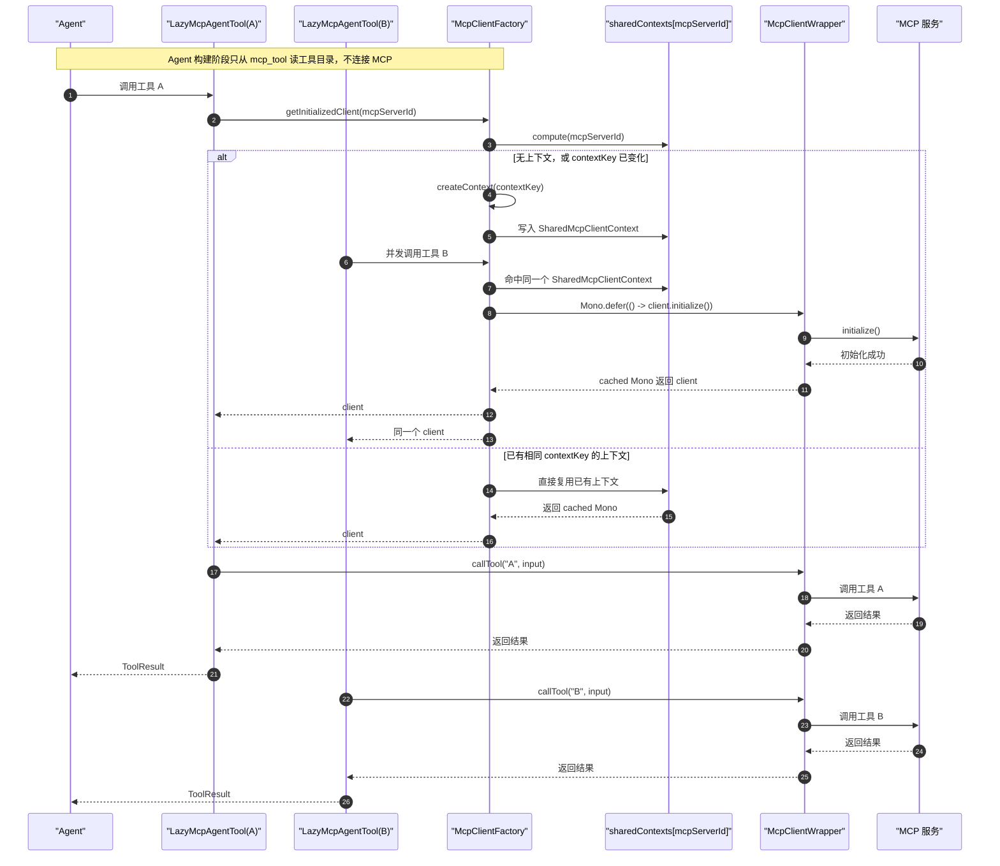

# MCP 分阶段改造说明

## 1. 改造背景

这次 MCP 改造分成两个阶段推进：

1. Phase 1 先处理运行时稳定性问题，目标是止血。
2. Phase 2 再补齐工具治理和前端交互，目标是把数据、运行时、界面三端语义统一起来。

原始问题同时包含：

- `listTools()` 空结果或异常时可能引发反复重试
- 同一 MCP 下多个工具首次调用时重复初始化连接
- 用户在前端能选到 MCP，但运行时未必真的会注册它的工具

因此最终策略是：

- 先让链路稳定
- 再把治理边界收清楚

## 2. Phase 1 说明

### 2.1 Phase 1 解决了什么

Phase 1 主要解决三类问题：

1. 去掉隐式刷新，避免 `listTools()` 空结果或失败时反复重试。
2. 让同一个 MCP 服务下多个工具共享连接初始化结果，避免重复建连。
3. 引入显式连接状态，让“已保存”和“可运行”彻底分开。

### 2.2 Phase 1 前的主要问题

#### 2.2.1 死循环隐患

原链路里，MCP 工具目录刷新有两条危险路径：

- 应用启动期自动刷新
- 运行时读路径触发刷新

如果某个 MCP 服务当前返回空工具列表、配置错误、或者服务不稳定，就可能出现：

1. 触发刷新
2. 刷新结果为空或失败
3. 系统判断“还需要刷新”
4. 再次触发刷新

最终形成重复重试，严重时会把进程拖死。

#### 2.2.2 工具重复初始化

同一个 MCP 服务下如果有几十个工具，原先每个工具第一次被调用时，都可能各自初始化一遍 MCP 连接。

这会导致：

- 首次调用延迟变高
- 连接创建次数异常膨胀
- 上游 MCP 服务压力变大

### 2.3 Phase 1 的核心方案

#### 2.3.1 引入显式连接状态

在 `mcp_server` 上新增了这些字段：

- `activation_status`
- `activation_message`
- `last_activation_time`
- `last_tool_sync_time`
- `tool_count`
- `activation_revision`
- `config_hash`
- `needs_sync`
- `activation_request_id`

其中关键语义是：

- `enabled`：业务层开关，决定这个 MCP 是否允许参与系统
- `activation_status`：技术运行态，决定当前是否已成功连接并拿到工具目录

因此：

- 保存成功，不等于 MCP 可用
- 只有显式连接成功，运行时才允许注册这类工具

#### 2.3.2 去掉读路径和启动期隐式刷新

Phase 1 之后，刷新入口被收敛成三种：

1. 手动连接
2. 手动刷新工具
3. 已连接 MCP 改配置后的自动重连

不再允许：

- 启动时因为缓存空而自动刷新
- 运行时因为读取工具列表顺手触发刷新

这样之后，刷新变成显式行为，不再藏在读路径里。

#### 2.3.3 引入共享连接上下文

共享连接 key：

- `mcpServerId + activationRevision + configHash`

含义是：

- 同一个 MCP 服务、同一个连接代次、同一份配置，只初始化一次
- 同一服务下多个工具复用同一个已初始化连接

同时加了失效控制：

- MCP 不可用时关闭旧上下文
- 重连成功且 `activationRevision` 变化时切换到新上下文
- 配置变化后旧上下文立即失效

### 2.4 调用时序图



### 2.5 状态流转图

```mermaid
stateDiagram-v2
    [*] --> "未建上下文"

    "未建上下文" --> "构建惰性工具": "Agent 注册工具"
    "构建惰性工具" --> "未建上下文": "仅从 mcp_tool 读目录"

    "未建上下文" --> "初始化中": "首次调用任一工具"
    "初始化中" --> "已初始化可复用": "initialize() 成功"
    "初始化中" --> "上下文已清理": "initialize() 失败"

    "已初始化可复用" --> "已初始化可复用": "同 MCP 下其他工具继续调用"

    "已初始化可复用" --> "上下文失效待重建": "configHash 变化"
    "已初始化可复用" --> "上下文失效待重建": "activationRevision 变化"
    "上下文失效待重建" --> "上下文已清理": "关闭旧 client"
    "上下文已清理" --> "未建上下文": "等待下一次调用"

    "已初始化可复用" --> "上下文已清理": "MCP 被停用"
    "已初始化可复用" --> "上下文已清理": "连接状态失效"
    "已初始化可复用" --> "上下文已清理": "运行时无可用工具"
```

### 2.6 Phase 1 运行时门控

Phase 1 期间，运行时工具目录真相源仍然是：

- `mcp_server.tool_schemas`

但只有满足以下条件才会注册工具：

1. `mcp_server.enabled = true`
2. `mcp_server.activation_status = ACTIVE`
3. `mcp_server.tool_count > 0`
4. `tool_schemas` 可解析且非空

### 2.7 Phase 1 的 SQL 变更

已运行项目增量脚本：

- [docs/2026-05-14-01.sql](/D:/projects/ai-apboa/apboa/docs/2026-05-14-01.sql)

初始化脚本同步修改：

- [docs/once_db_init/db_init.sql](/D:/projects/ai-apboa/apboa/docs/once_db_init/db_init.sql)

另外：

- `tool_schemas` 列已在 [docs/2026-05-13-01.sql](/D:/projects/ai-apboa/apboa/docs/2026-05-13-01.sql) 中增量添加
- 本次没有修改 `docs/schema.sql`

### 2.8 Phase 1 验证结果

- `mvn -pl common,core,biz/mcp -am -DskipTests compile` 通过
- `ui` 下 `npm run type-check` 通过

`ui` 下 `npm run build-only` 仍受沙箱环境 `esbuild spawn EPERM` 影响，不作为代码正确性结论。

## 3. Phase 2 说明

### 3.1 Phase 2 解决了什么

Phase 2 主要解决的是“治理语义不一致”的问题：

- 前端能选到某个 MCP
- 但运行时不一定真的会注册它的工具

具体目标有四个：

1. 引入 `mcp_tool` 作为工具目录真相源
2. 引入 `agent_mcp_tool` 和 `agent_mcp_servers.exposure_mode`
3. MCP 管理端支持全局工具启停
4. Agent 配置端支持局部缩小工具范围

### 3.2 Phase 2 的最终语义

#### 3.2.1 MCP 全局层

- `mcp_server.enabled = false`：整个 MCP 不可用
- `mcp_server.activation_status != ACTIVE`：整个 MCP 不可用
- `mcp_tool.enabled = false`：该工具全局禁用
- `mcp_tool.missing = true`：该工具已从服务端消失，仅保留历史记录，不参与运行时注册

#### 3.2.2 Agent 局部层

`agent_mcp_servers.exposure_mode` 新增两种模式：

- `ALL_GLOBAL`
  - 当前 Agent 继承该 MCP 下所有“全局可用且未消失”的工具
- `SELECTED_ONLY`
  - 当前 Agent 只暴露 `agent_mcp_tool` 中勾选的工具
  - 即使历史上选中过，如果后来被全局禁用或已消失，运行时也不会注册，只保留展示

#### 3.2.3 Phase 2 运行时门控

运行时现在满足以下条件才会注册某个 MCP 工具：

1. `mcp_server.enabled = true`
2. `mcp_server.activation_status = ACTIVE`
3. 工具目录来自 `mcp_tool`
4. `mcp_tool.enabled = true`
5. `mcp_tool.missing = false`
6. 如果 Agent 绑定模式是 `SELECTED_ONLY`，该工具还必须在 `agent_mcp_tool` 中被选中

## 4. 数据模型变更

### 4.1 新增表 `mcp_tool`

用途：

- 保存某个 MCP 服务下的工具目录
- 作为运行时注册工具的唯一目录来源

关键字段：

- `mcp_server_id`
- `tool_name`
- `description`
- `input_schema`
- `output_schema`
- `raw_schema`
- `schema_hash`
- `enabled`
- `missing`
- `sort`
- `last_discovered_at`
- `last_seen_at`

说明：

- `raw_schema` 保存原始 MCP 工具定义，运行时会反序列化回 `McpSchema.Tool`
- `enabled` 是工具的全局开关
- `missing = true` 表示该工具曾存在，但最近一次刷新时已不再出现

### 4.2 扩展表 `agent_mcp_servers`

新增字段：

- `exposure_mode`

枚举值：

- `ALL_GLOBAL`
- `SELECTED_ONLY`

### 4.3 新增表 `agent_mcp_tool`

用途：

- 保存 Agent 在 `SELECTED_ONLY` 模式下勾选的 MCP 工具

## 5. 工具目录同步策略

### 5.1 连接或刷新成功后

在原来 `tool_schemas` 缓存更新的基础上，Phase 2 新增：

1. 解析最新 `tool_schemas`
2. 对 `mcp_tool` 执行 upsert
3. 对当前仍存在的工具：
   - 更新描述、Schema、排序、最近发现时间
   - 清除 `missing`
4. 对当前未再出现的旧工具：
   - 保留历史记录
   - 标记 `missing = true`

### 5.2 历史缓存回填

这次没有要求先用 SQL 批量把历史 `tool_schemas` 搬到 `mcp_tool`。

实际策略是：

- 读取某个 MCP 的工具目录时，如果 `mcp_tool` 里还没有该 MCP 的记录
- 且 `mcp_server.tool_schemas` 中已有可解析缓存
- 则由应用按缓存进行一次回填

这样既兼容历史数据，也避免为 ID 生成和 JSON 搬运写一段高风险迁移 SQL。

## 6. 后端链路调整

### 6.1 MCP 管理端

新增能力：

- 查询某个 MCP 的工具列表
- 批量切换某个 MCP 下工具的全局可用状态

新增接口：

- `GET /mcp/server/{id}/tools`
- `PUT /mcp/server/{id}/tools/global-enabled`

`McpServerVO` 同时新增：

- `availableToolCount`

用于展示“当前全局可用工具数”，和 `toolCount` 的“缓存目录工具总数”区分开。

### 6.2 Agent 详情与保存

`AgentDefinitionVO` 新增：

- `mcpBindings`

每个绑定包含：

- `mcpServerId`
- `exposureMode`
- `mcpToolIds`

兼容策略：

- 详情接口同时返回旧字段 `mcp` 和新字段 `mcpBindings`
- 保存时优先使用 `mcpBindings`
- 如果仍然是旧数据结构，则自动按 `ALL_GLOBAL` 兜底

### 6.3 运行时工具注册

`McpClientFactory` 不再从 `mcp_server.tool_schemas` 直接生成懒加载工具，而是：

1. 读取 Agent 的 `mcpBindings`
2. 校验 MCP 自身是否可用
3. 从 `mcp_tool` 读取运行时可注册工具
4. 按 `ALL_GLOBAL / SELECTED_ONLY` 做二次过滤
5. 把 `raw_schema` 反序列化回 `McpSchema.Tool`
6. 再构建 `LazyMcpAgentTool`

至此，运行时工具目录真相源正式从 `tool_schemas` 切换到 `mcp_tool`。

## 7. 前端职责与文案收口

### 7.1 三个动作的职责

这次把前端动作职责收成三件事：

1. `启用 / 停用`
   - 业务治理层开关
   - 决定该 MCP 是否允许参与系统
   - 不负责连通性校验，不负责刷新工具目录

2. `连接`
   - 技术可用层动作
   - 负责校验连通性并加载工具目录
   - 对应后端 `activate`

3. `刷新工具`
   - 目录同步层动作
   - 只在当前配置基础上重新获取工具目录
   - 对应后端 `sync-tools`

### 7.2 MCP 管理页

页面文案从“激活”改成“连接”，并按状态决定主动作：

- 已停用：显示 `启用`
- 待连接：显示 `连接`
- 连接失败：显示 `重试连接`
- 可用：显示 `刷新工具`
- 已连接（无工具）：显示 `刷新工具`

卡片和详情页同时显示：

- 连接状态
- 工具总数
- 全局可用工具数
- 是否待刷新

### 7.3 Agent 配置页

Agent 侧 MCP 选择区现在会明确展示：

- 连接状态
- 全局可用工具数
- 当前不可用原因

不可用原因统一收敛为：

- `已停用`
- `待连接`
- `连接中`
- `连接失败`
- `无全局可用工具`
- `已连接（无工具）`

这样用户看到的是“为什么当前不能用”，而不是去猜 `enabled` 和 `activation_status` 的组合关系。

## 8. SQL 变更说明

### 8.1 已运行项目

Phase 2 增量脚本：

- [docs/2026-05-15-01.sql](/D:/projects/ai-apboa/apboa/docs/2026-05-15-01.sql)

内容包括：

- `agent_mcp_servers` 增加 `exposure_mode`
- 新建 `mcp_tool`
- 新建 `agent_mcp_tool`

### 8.2 初始化脚本

直接同步到：

- [docs/once_db_init/db_init.sql](/D:/projects/ai-apboa/apboa/docs/once_db_init/db_init.sql)

### 8.3 约束说明

本次没有修改：

- `docs/schema.sql`

## 9. 当前验证结果

以当前 Phase 1 + Phase 2 合并结果为准，已验证：

- `mvn -o -pl common,core,biz/mcp,biz/agent -am -DskipTests compile`：通过
- `ui` 下 `npm run type-check`：通过
- `ui` 下 `npm run build-only`：仍受沙箱环境 `esbuild spawn EPERM` 影响，不作为代码正确性结论

其中：

- Java 编译通过，说明后端模型、服务、运行时切换链路已打通
- 前端类型检查通过，说明 Agent 绑定结构和 MCP 工具治理字段已接通

## 10. 最终结果总结

两阶段完成后，MCP 这条链路已经从“能跑但不稳定、不一致”，收敛成“稳定且可治理”：

- Phase 1 解决了死循环、重复初始化、运行态不可控的问题
- Phase 2 解决了工具目录真相源、全局工具治理、Agent 局部选择、前后端语义不一致的问题

现在 MCP 的：

- 可保存
- 可启用
- 可连接
- 可刷新
- 可治理
- 可选择
- 可注册

都落在同一套语义上了。
